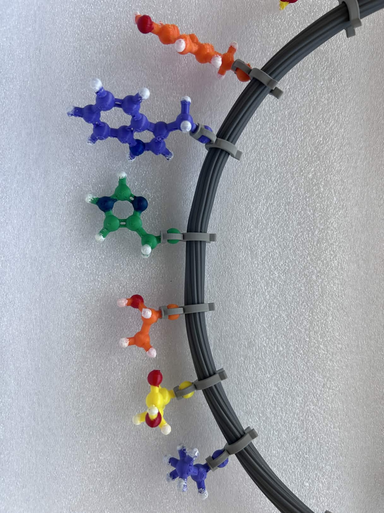
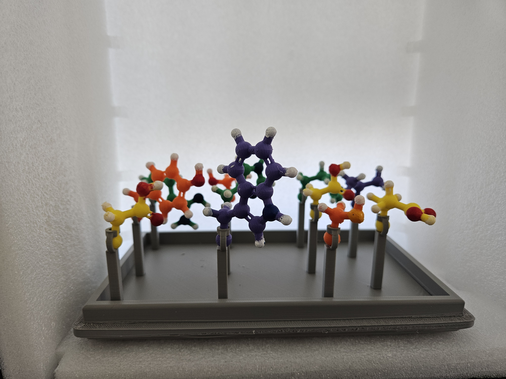

## Protein Folding Model

**Figure 1.** Multiple amino acid side chains attached to the bendy tube to model specific peptide sequence.

**Figure 2.** A display stand for the amino acid side chains.​

**Figure 3.**  A close-up of the attachment mechanism.

**Figure 4.** A close-up of 3D printed amino acid side chain, attachment and bendy tube assembly.
